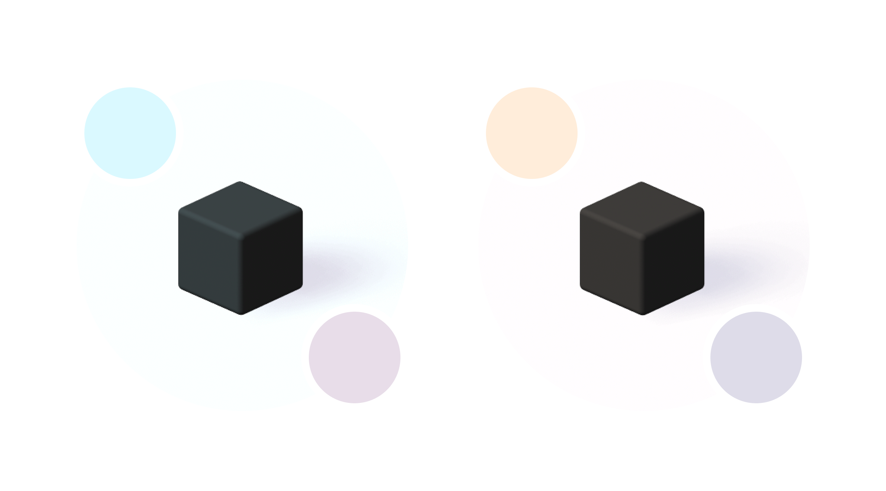
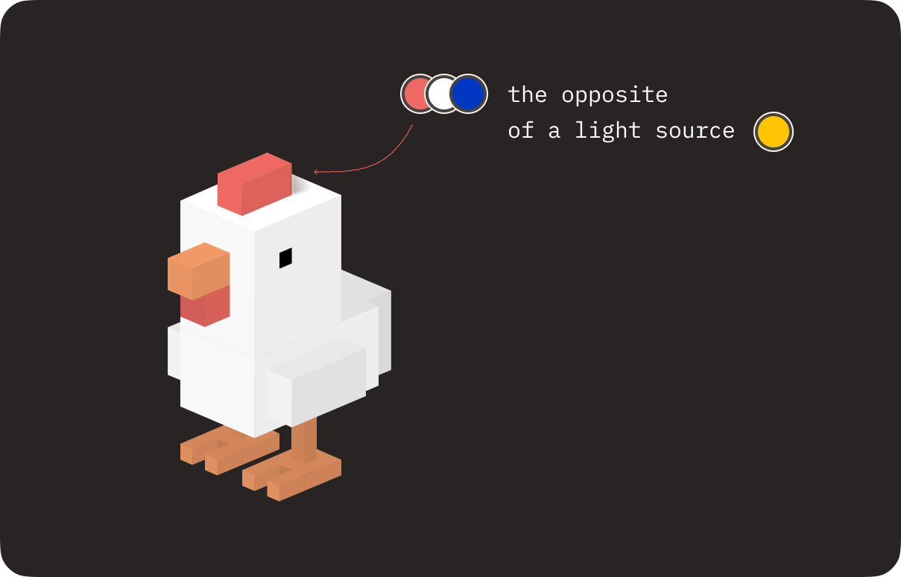

Hey there, CSS fans! This is the second part of a 3D series. The first one is [here](/post/3d-cube-with-css), start from there. 

Last time we created a universal cube and a chicken. But today we’ll try to make it and some other objects real. We’ll learn what is a light source, why we need it and how to work with it.

  
Watch video

  
  <iframe width="100%" height="400" src="https://www.youtube.com/embed/2FEgcYfiTEM?si=EnnVkz4-3weMGq9J" title="YouTube video player" frameborder="0" allow="accelerometer; autoplay; clipboard-write; encrypted-media; gyroscope; picture-in-picture; web-share" referrerpolicy="strict-origin-when-cross-origin" allowfullscreen></iframe>

In real life, we have the sun, a lamp, or anything else that produces light. In CSS… well, we don’t have actual light sources. But we can fake it — and we can make it *look* real. Highlights, shadows, warmth, reflections — all from code. Let's break down how real light behaves, and then I’ll show you how to mimic that in CSS.

## Light Source Characteristics

A light source has a few key traits: distance, direction, size, warmth, intensity, and quantity. I’ll show examples as we go.

### Distance

**Distance** is how far the light is from the object. It could be right above, way off to the side — or very far away.

The closer the light source, the brighter the object appears. As the distance increases, the light fades — so we’ll need to factor that in when simulating it.

import Example2 from './light-and-shadow-in-css/example2.md';

<Example2 />

### Direction

To get a sense of **direction**, imagine a regular desk lamp. It shines light in one direction. Now picture a tube light — it throws light out more evenly, in multiple directions.

The shape of the light source matters too. A flat light creates a shadow similar to the object's shape. A directional or narrow light distorts that shadow more.

So when you place a virtual light in your CSS scene, its direction will change how your shadows look and where your highlights land.

### Size

Lighting a room with a candle? Not gonna work. You’ll only light a tiny part.

Same in 3D: the smaller the light source, the smaller the area it affects. A large, diffuse light spreads more softly and affects a wider range of surfaces.

### Intensity

**Intensity** is all about contrast. Higher **intensity** means stronger contrast between lit and shadowed areas. It also means sharper, more defined shadows. Lower intensity softens everything — lights, transitions, and shadows.

import Example1 from './light-and-shadow-in-css/example1.md';

<Example1 />

### Warmth

Light has **temperature** — warm or cool. The **warmth** of your light source affects color. A warm light (like a candle or the sun at sunset) casts yellow-orange highlights and cool blue-ish shadows. A cool light (like some LEDs) does the opposite — bluish highlights and warmer, brown-ish shadows.

### Quantity

Can you have multiple light sources? Absolutely. Should you? Maybe.

Multiple lights can make a scene look more real or dramatic, but they also make it more complex — especially in CSS. If you’ve got time and patience, go for it. If not, stick with one and master it first.

## Creating a Light Source in CSS

Here’s how I approach it in CSS. When I start working on lighting in CSS, I usually sketch it out. I draw the light source, draw rays from it to my object, and use that to decide where the highlights and shadows go.

I place the light wherever I need in the scene, then imagine how the light rays would interact with the object’s surfaces.

import Example4 from './light-and-shadow-in-css/example4.md';

<Example4 />

## Color Logic

To keep things manageable, I define a custom property for the main object color. If I’m working with a complex object, I might define a few.

  <pre class="example__code"><code class="language-css">--red:  #FF5E5B;
--white:  #FFFFFF;
--orange:  #ff945b;</code></pre>

Then I look for the surface *closest* to the light. That surface gets the **purest** form of the light color — but not directly. I use the `color-mix()` function to blend the light color with a shadow color.

  <pre class="example__code"><code class="language-css">background-color: color-mix(in srgb, var(--color), var(--light) 0%);</code></pre>

I also define the shadow color as another custom property. For now, let’s say it’s black — we can tweak that later.

Surfaces slightly further away get a slightly darker tint — still using `color-mix()`, just with different ratios. The more distant the surface, the more of the shadow color it takes on.

import Example5 from './light-and-shadow-in-css/example5.md';

<Example5 />

If your light source is super intense, push the contrast: your highlights will be brighter, and the backside of the object might be nearly black.

If your light is soft and diffused, surfaces will blend more evenly.

## Shadow Color

**Shadow color** depends on the warmth of the light source. In practice, your shadow color is a mix of the object’s base color, the light source’s warmth, and the angle of the surface.

For my object I got `#c07d9e` color. Now, I need to make it darker, mixing it with black color.

  <pre class="example__code"><code class="language-css">--shadow: color-mix(in srgb, #c07d9e, #000000 50%);</code></pre>

## Casting Shadows in CSS

Here’s how I handle shadows: I draw imaginary light rays from the source to the edges of the object. Then I outline the shape using the `clip-path` property.

import Example6 from './light-and-shadow-in-css/example6.md';

<Example6 />

Usually, I apply this shape to a `::before` pseudo-element and blur it using the `filter` on the parent.

import Example7 from './light-and-shadow-in-css/example7.md';

<Example7 />

The amount of blur depends on: **size**, **intensity** and **direction** of the light. Smaller, more intense, directional lights cast crisp shadows. Big soft lights? Blurry shadows.

## Shadows *On* the Object

This is different from the cast shadow. Here’s how I do it:

1. For simple shapes — gradients.
1. For complex shapes — the `::after` pseudo-element. That lets me layer the object’s color separately from its shadows.

  

    See the Pen <a href="https://codepen.io/miocene/pen/OPVZwEx">
    Chicken. Complete 3D CSS Guide Part 2</a> by Julia Miocene (<a href="https://codepen.io/miocene">@miocene</a>)
    on <a href="https://codepen.io">CodePen</a>.
  

  

## Some other examples

This knowledge is useful for objects with any complexity: a cube in a clean environment, a cubic character, a polygonal cat, an eye, or the hands of God and Adam from The Creation of Adam.

  

    See the Pen <a href="https://codepen.io/miocene/pen/QwLOQBB">
    Pure CSS 3D Cat</a> by Julia Miocene (<a href="https://codepen.io/miocene">@miocene</a>)
    on <a href="https://codepen.io">CodePen</a>.
  

  

    See the Pen <a href="https://codepen.io/miocene/pen/XJWVvey">
    Pure CSS 3D David Eye</a> by Julia Miocene (<a href="https://codepen.io/miocene">@miocene</a>)
    on <a href="https://codepen.io">CodePen</a>.
  

  

    See the Pen <a href="https://codepen.io/miocene/pen/dPoeqZV/b9a8d13603829eb43f97662d78fd3939">
    Pure CSS 3D Creation of Adam</a> by Julia Miocene (<a href="https://codepen.io/miocene">@miocene</a>)
    on <a href="https://codepen.io">CodePen</a>.
  

Now you know how to create a cubic character and use a light source. Next time, we’ll learn how to create more complex characters, animate them, sculpt, do origami and more!

Today, we learned what a light source is, why we need it, and how to work with it. Share your demos on your favorite social media and tag me @julia_miocene.

Don’t forget to keep the web weird.